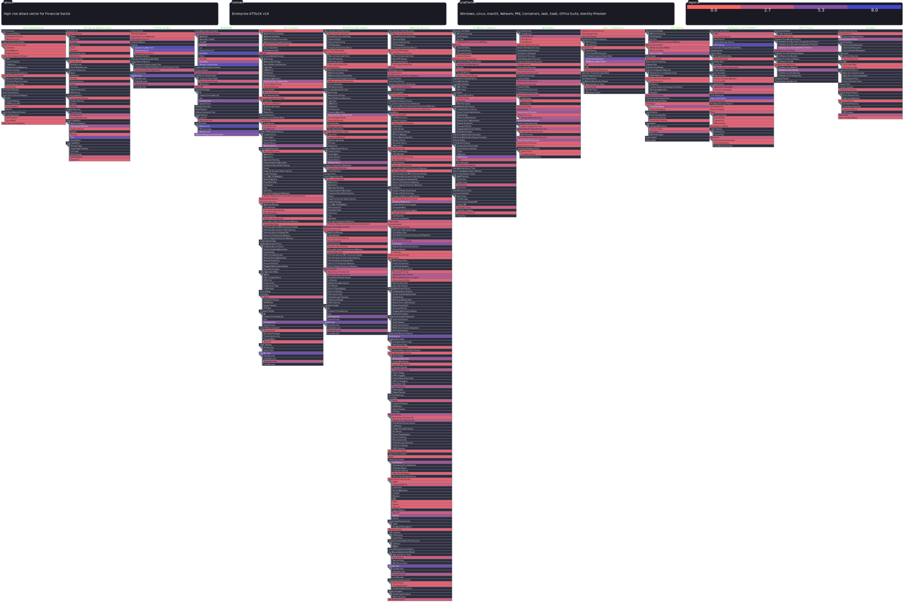

# APT groups specifically targeting the Finance Sector

OpenCTI are often packed with information and not easy to read, there are countless of APT groups out there which target different fields and industries. 
This folder is specifically documented for the financial sector. These are APT most notoriously hacking for financial gains (not exclude to). Below is a link to their most 
used and probable attack methods.

